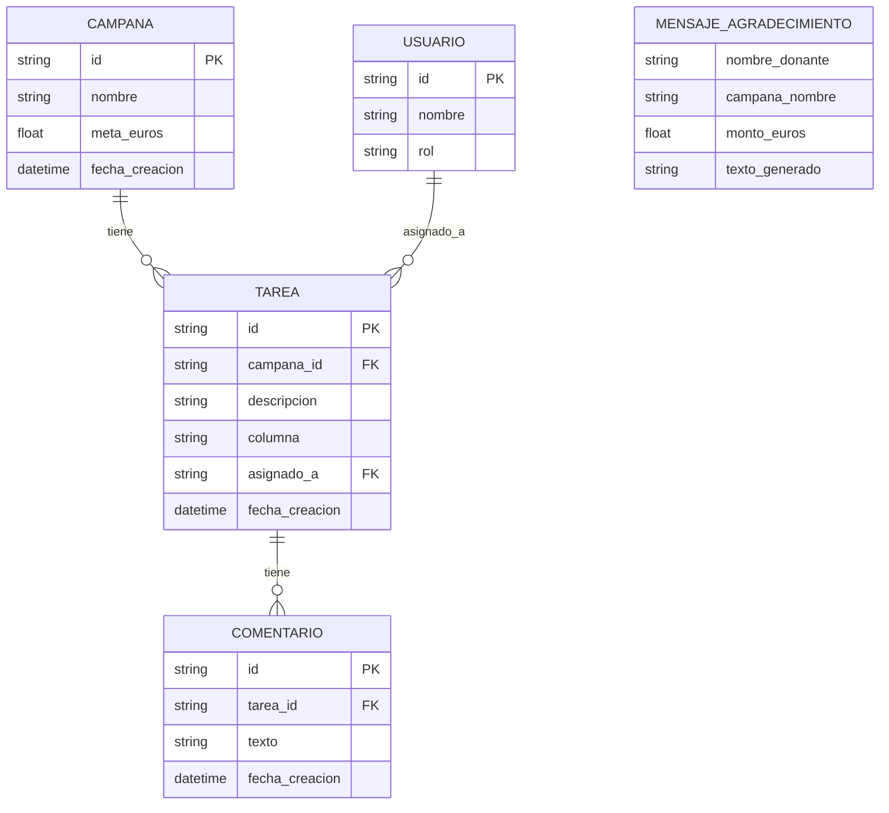

# Data Model: Fundraising Campaign Management

**Feature**: M365 Copilot Agent for Non-Profit Fundraising Management  
**Technology**: C# / .NET 10 + Microsoft Agent Framework  
**Date**: 2025-12-01  
**Status**: Phase 1 Complete (Updated for C#)

## Overview

This document defines the data entities for the fundraising campaign management agent. All entities are held in-memory for demo purposes (no persistent database). Azure AI Foundry manages conversation thread state separately.

**Implementation Language**: C# record types with nullable reference types enabled.

---

## Core Entities

### 1. Campaña (Campaign)

**Purpose**: Represents a fundraising initiative with a financial goal.

**Attributes**:

| Nombre          | Tipo                 | Obligatorio | Descripción                                    |
| --------------- | -------------------- | ----------- | ---------------------------------------------- |
| `Id`            | `string` (GUID)      | Sí          | Identificador único de la campaña              |
| `Nombre`        | `string`             | Sí          | Nombre de la campaña (ej: "Navidad Solidaria") |
| `MetaEuros`     | `decimal`            | Sí          | Meta financiera en euros (ej: 5000.0)          |
| `FechaCreacion` | `DateTime`           | Sí          | Fecha y hora de creación                       |
| `Tareas`        | `List<string>` (IDs) | No          | Lista de IDs de tareas asociadas               |

**Invariantes**:

-   `MetaEuros` DEBE ser > 0
-   `Nombre` NO puede estar vacío
-   `Id` es inmutable después de creación

**Relationships**:

-   Una campaña TIENE muchas tareas (relación 1:N)
-   Las tareas referencian su campaña padre via `CampañaId`

**Example (C# record)**:

```csharp
public record Campaña(
    string Id,
    string Nombre,
    decimal MetaEuros,
    DateTime FechaCreacion,
    List<string>? Tareas = null
);

// Ejemplo de instancia:
var campaña = new Campaña(
    Id: "c1-navidad-2025",
    Nombre: "Navidad Solidaria",
    MetaEuros: 5000.0m,
    FechaCreacion: DateTime.UtcNow,
    Tareas: ["t1", "t2", "t3"]
);
```

---

### 2. Tarea (Task)

**Purpose**: Represents an actionable work item within a campaign.

**Attributes**:

| Nombre          | Tipo                   | Obligatorio | Descripción                        |
| --------------- | ---------------------- | ----------- | ---------------------------------- |
| `Id`            | `string` (GUID)        | Sí          | Identificador único de la tarea    |
| `CampañaId`     | `string`               | Sí          | ID de la campaña padre             |
| `Descripcion`   | `string`               | Sí          | Descripción de la tarea            |
| `Columna`       | `ColumnaKanban` (enum) | Sí          | Estado del workflow                |
| `AsignadoA`     | `string?`              | No          | ID del usuario asignado (opcional) |
| `Comentarios`   | `List<string>` (IDs)   | No          | Lista de IDs de comentarios        |
| `FechaCreacion` | `DateTime`             | Sí          | Fecha y hora de creación           |

**Enumerations**:

```csharp
public enum ColumnaKanban
{
    PorHacer,
    EnProgreso,
    Completado
}
```

**Invariantes**:

-   `Columna` DEBE ser uno de los tres valores del enum
-   `CampañaId` DEBE referenciar una campaña existente
-   `Descripcion` NO puede estar vacía
-   `asignado_a` si presente, DEBE referenciar un usuario existente

**Relationships**:

-   Una tarea PERTENECE a exactamente una campaña
-   Una tarea TIENE muchos comentarios (relación 1:N)
-   Una tarea puede estar ASIGNADA a un usuario (relación N:1)

**State Transitions**:

```text
por_hacer → en_progreso → completado
    ↑          ↓              ↓
    └──────────┴──────────────┘
    (permitido mover en cualquier dirección)
```

**Example (C# record)**:

```csharp
public record Tarea(
    string Id,
    string CampañaId,
    string Descripcion,
    ColumnaKanban Columna,
    string? AsignadoA = null,
    List<string>? Comentarios = null,
    DateTime? FechaCreacion = null
);

// Ejemplo de instancia:
var tarea = new Tarea(
    Id: "t1",
    CampañaId: "c1-navidad-2025",
    Descripcion: "Contactar 20 donantes principales",
    Columna: ColumnaKanban.PorHacer,
    AsignadoA: "u1-coordinadora",
    Comentarios: ["com1", "com2"],
    FechaCreacion: new DateTime(2025, 12, 1, 10, 5, 0, DateTimeKind.Utc)
);
```

---

### 3. Usuario (Team Member)

**Purpose**: Represents a person who can be assigned tasks.

**Attributes**:

| Nombre   | Tipo                | Obligatorio | Descripción                     |
| -------- | ------------------- | ----------- | ------------------------------- |
| `Id`     | `string`            | Sí          | Identificador único del usuario |
| `Nombre` | `string`            | Sí          | Nombre completo del usuario     |
| `Rol`    | `RolUsuario` (enum) | Sí          | Rol: Coordinadora o Voluntario  |

**Enumerations**:

```csharp
public enum RolUsuario
{
    Coordinadora,
    Voluntario
}
```

**C# Record**:

```csharp
public record Usuario(
    string Id,
    string Nombre,
    RolUsuario Rol
);
```

**Predefined Users** (per FR-018):

```csharp
public static readonly List<Usuario> UsuariosPredefinidos = [
    new Usuario(
        Id: "u1-coordinadora",
        Nombre: "Ana García",
        Rol: RolUsuario.Coordinadora
    ),
    new Usuario(
        Id: "u2-voluntario",
        Nombre: "Carlos Ruiz",
        Rol: RolUsuario.Voluntario
    ),
    new Usuario(
        Id: "u3-voluntario",
        Nombre: "María López",
        Rol: RolUsuario.Voluntario
    )
];
```

**Invariantes**:

-   Exactly 3 users exist (no user creation/deletion for demo)
-   `id` is immutable
-   One user with `rol="coordinadora"`, two with `rol="voluntario"`

**Relationships**:

-   Un usuario puede tener MUCHAS tareas asignadas (relación 1:N)

---

### 4. Comentario (Comment)

**Purpose**: Represents a text note added to a task.

**Attributes**:

| Nombre          | Tipo            | Obligatorio | Descripción                        |
| --------------- | --------------- | ----------- | ---------------------------------- |
| `Id`            | `string` (GUID) | Sí          | Identificador único del comentario |
| `TareaId`       | `string`        | Sí          | ID de la tarea padre               |
| `Texto`         | `string`        | Sí          | Contenido del comentario           |
| `FechaCreacion` | `DateTime`      | Sí          | Fecha y hora de creación           |

**Invariantes**:

-   `TareaId` DEBE referenciar una tarea existente
-   `Texto` NO puede estar vacío
-   Comentarios son inmutables después de creación (no edición/borrado)

**Relationships**:

-   Un comentario PERTENECE a exactamente una tarea

**Ordering**: Comentarios se muestran en orden cronológico ascendente por `FechaCreacion`

**Example (C# record)**:

```csharp
public record Comentario(
    string Id,
    string TareaId,
    string Texto,
    DateTime FechaCreacion
);

// Ejemplo de instancia:
var comentario = new Comentario(
    Id: "com1",
    TareaId: "t1",
    Texto: "Llamé a 10 donantes hoy, 3 confirmaron su aportación",
    FechaCreacion: new DateTime(2025, 12, 1, 14, 30, 0, DateTimeKind.Utc)
);
```

**Note**: Per Assumption #8, comments do NOT track authorship (no `usuario_id` field) to reduce demo complexity.

---

### 5. MensajeAgradecimiento (Thank-You Message)

**Purpose**: Represents an AI-generated draft communication to a donor.

**Attributes**:

| Nombre          | Tipo       | Obligatorio | Descripción                               |
| --------------- | ---------- | ----------- | ----------------------------------------- |
| `NombreDonante` | `string`   | Sí          | Nombre del donante                        |
| `CampañaNombre` | `string`   | Sí          | Nombre de la campaña                      |
| `MontoEuros`    | `decimal?` | No          | Cantidad donada (opcional)                |
| `TextoGenerado` | `string`   | Sí          | Mensaje de agradecimiento generado por IA |

**C# Record**:

```csharp
public record MensajeAgradecimiento(
    string NombreDonante,
    string CampañaNombre,
    string TextoGenerado,
    decimal? MontoEuros = null
);
```

**Generation Rules**:

-   DEBE incluir saludo personalizado con `nombre_donante`
-   DEBE mencionar la `campaña_nombre`
-   SI `monto_euros` presente, DEBE mencionar la cantidad
-   DEBE usar tono cálido y profesional apropiado para ONG, definido como:
    -   **Formalidad del saludo**: Usar "Estimado/a" o "Querido/a" (formal-amigable), evitar "Hola" muy casual o "Distinguido/a" rígido
    -   **Estructura de oraciones**: 2-4 oraciones totales; primera oración expresa gratitud, oración(es) intermedia(s) explican impacto, oración final refuerza apreciación
    -   **Palabras emocionales**: Incluir al menos 2 de: agradecimiento, generoso/a, apoyo, impacto, esperanza, comunidad, transformar, posible
    -   **Ejemplos de tono**: "Queremos expresar nuestro más sincero agradecimiento", "Tu apoyo hace posible", "Gracias a personas como tú"
-   DEBE estar completamente en español
-   DEBE ser adecuado para uso directo o edición menor

**Example with amount (C#)**:

```csharp
var mensajeConMonto = new MensajeAgradecimiento(
    NombreDonante: "María García",
    CampañaNombre: "Navidad Solidaria",
    TextoGenerado: "Estimada María García,\n\nQueremos expresar nuestro más sincero agradecimiento por tu generosa contribución de 100 euros a nuestra campaña Navidad Solidaria. Tu apoyo hace posible que podamos llevar alegría y esperanza a familias que más lo necesitan durante estas fiestas.\n\nGracias a personas como tú, estamos más cerca de alcanzar nuestra meta y generar un impacto real en nuestra comunidad.\n\nCon gratitud,\nEquipo de Captación de Fondos",
    MontoEuros: 100.0m
);
```

**Example without amount (C#)**:

```csharp
var mensajeSinMonto = new MensajeAgradecimiento(
    NombreDonante: "Carlos Ruiz",
    CampañaNombre: "Educación Rural",
    TextoGenerado: "Estimado Carlos Ruiz,\n\nQueremos agradecerte profundamente por tu valiosa contribución a nuestra campaña Educación Rural. Tu apoyo es fundamental para ayudarnos a llevar oportunidades educativas a comunidades que tanto lo necesitan.\n\nCada aportación suma y nos acerca más a nuestra meta de transformar vidas a través de la educación.\n\nCon gratitud,\nEquipo de Captación de Fondos"
);
```

**Important**: Per DD-001, donors are NOT stored as persistent entities. This structure is used only for message generation parameters and output. No donor database or CRUD operations.

---

## Entity Relationship Diagram



**Note**: `MENSAJE_AGRADECIMIENTO` is not connected to other entities because it's an ephemeral generation output, not a stored entity.

---

## Data Storage Strategy

### In-Memory State (Demo)

**Rationale**: Per Assumption #2, data only needs to persist for demo session duration.

**Implementation (C#)**:

```csharp
// Global state (in-memory dictionaries)
public class EstadoAgente
{
    public Dictionary<string, Campaña> Campañas { get; set; } = new();
    public Dictionary<string, Tarea> Tareas { get; set; } = new();
    public Dictionary<string, Comentario> Comentarios { get; set; } = new();
    public Dictionary<string, Usuario> Usuarios { get; set; } =
        UsuariosPredefinidos.ToDictionary(u => u.Id);

    /// <summary>
    /// Carga 3 campañas de ejemplo con 3-5 tareas cada una
    /// </summary>
    public void InicializarDatosEjemplo()
    {
        // Implementation in Datos/DatosEjemplo.cs
    }
}
```

### Azure AI Foundry Thread State

**Conversation History**: Managed by Azure AI Foundry Agent Service

-   Agent maintains conversation context across turns
-   Thread ID persisted for multi-turn interactions
-   No manual history management required

### NO Persistent Database

**Explicit Decision**: No PostgreSQL, MongoDB, Azure Storage persistence

**Why**:

-   Demo-first principle (Principle I)
-   Single-user, single-session usage (Assumption #4)
-   Setup time reduction for live demo

**Trade-off Acknowledged**: Data lost on agent restart. Acceptable for demo context.

---

## Validation Rules

### Campaign Creation (C#)

```csharp
public static class ValidadorCampaña
{
    public static void ValidarCampaña(string nombre, decimal metaEuros,
        Dictionary<string, Campaña> campañasExistentes)
    {
        if (string.IsNullOrWhiteSpace(nombre))
            throw new ArgumentException("El nombre de la campaña no puede estar vacío");

        if (metaEuros <= 0)
            throw new ArgumentException("La meta debe ser mayor que cero");

        // Check for duplicate names (edge case handling)
        if (campañasExistentes.Values.Any(c => c.Nombre == nombre))
            throw new InvalidOperationException(
                $"Ya existe una campaña con el nombre '{nombre}'");
    }
}
```

### Task Operations (C#)

```csharp
public static class ValidadorTarea
{
    public static void ValidarTarea(string campañaId, string descripcion,
        string? asignadoA, Dictionary<string, Campaña> campañas,
        Dictionary<string, Usuario> usuarios)
    {
        if (!campañas.ContainsKey(campañaId))
            throw new ArgumentException($"Campaña '{campañaId}' no existe");

        if (string.IsNullOrWhiteSpace(descripcion))
            throw new ArgumentException("La descripción de la tarea no puede estar vacía");

        if (asignadoA != null && !usuarios.ContainsKey(asignadoA))
            throw new ArgumentException($"Usuario '{asignadoA}' no existe");
    }

    public static void ValidarMovimientoTarea(string tareaId, ColumnaKanban nuevaColumna,
        Dictionary<string, Tarea> tareas)
    {
        if (!tareas.ContainsKey(tareaId))
            throw new ArgumentException($"Tarea '{tareaId}' no existe");

        // Enum validation is automatic in C#, but included for clarity
        if (!Enum.IsDefined(typeof(ColumnaKanban), nuevaColumna))
            throw new ArgumentException($"Columna '{nuevaColumna}' no es válida");
    }
}
```

### Comment Addition (C#)

```csharp
public static class ValidadorComentario
{
    public static void ValidarComentario(string tareaId, string texto,
        Dictionary<string, Tarea> tareas)
    {
        if (!tareas.ContainsKey(tareaId))
            throw new ArgumentException($"Tarea '{tareaId}' no existe");

        if (string.IsNullOrWhiteSpace(texto))
            throw new ArgumentException("El texto del comentario no puede estar vacío");
    }
}
```

---

## Sample Data (Pre-populated)

**Overview**: Three campaigns pre-populated with 3-5 tasks each (per FR-004), totaling 15 tasks distributed across workflow columns with predefined assignees.

**File Location**: `src/AgenteRecaudacion/Datos/DatosEjemplo.cs`

### Campaign 1: Navidad Solidaria

-   **Meta**: 5000 euros
-   **Tasks** (5 tasks):
    1. "Contactar 20 donantes principales" - Por Hacer - Asignada a Ana García
    2. "Organizar evento de recaudación navideño" - En Progreso - Asignada a Carlos Ruiz
    3. "Preparar material promocional" - Completado - Asignada a María López
    4. "Enviar mensajes de agradecimiento" - Por Hacer - Sin asignar
    5. "Actualizar redes sociales" - En Progreso - Asignada a Carlos Ruiz

### Campaign 2: Educación Rural

-   **Meta**: 3000 euros
-   **Tasks** (5 tasks):
    1. "Identificar escuelas beneficiarias" - Completado - Asignada a Ana García
    2. "Solicitar donaciones de material escolar" - En Progreso - Asignada a María López
    3. "Coordinar entrega de suministros" - Por Hacer - Asignada a Carlos Ruiz
    4. "Documentar impacto en comunidades" - Por Hacer - Sin asignar
    5. "Agradecer a patrocinadores corporativos" - Por Hacer - Asignada a Ana García

### Campaign 3: Salud Comunitaria

-   **Meta**: 4000 euros
-   **Tasks** (5 tasks):
    1. "Organizar jornada médica gratuita" - En Progreso - Asignada a Ana García
    2. "Reclutar voluntarios médicos" - Completado - Asignada a María López
    3. "Conseguir donación de medicamentos" - Por Hacer - Asignada a Carlos Ruiz
    4. "Promocionar jornada en centros comunitarios" - Por Hacer - Sin asignar
    5. "Agradecer a profesionales de salud" - Por Hacer - Asignada a María López

**Distribution Summary**:

-   Total: 15 tasks
-   Por Hacer: 8 tasks
-   En Progreso: 4 tasks
-   Completado: 3 tasks
-   Tasks per campaign: 5 each (meets FR-004 requirement of 3-5 tasks)

---

## Traceability to Requirements

| Entity                    | Requirements Satisfied                                                 |
| ------------------------- | ---------------------------------------------------------------------- |
| **Campaña**               | FR-001, FR-002, FR-003, FR-004, SC-001, SC-008                         |
| **Tarea**                 | FR-005, FR-006, FR-007, FR-008, FR-009, FR-010, SC-002, SC-009, SC-010 |
| **Usuario**               | FR-009, FR-018, FR-019, SC-005                                         |
| **Comentario**            | FR-011, FR-012, FR-013, SC-006                                         |
| **MensajeAgradecimiento** | FR-014, FR-015, FR-016, FR-017, FR-020, SC-003, SC-004                 |

---

**Version**: 1.0.0  
**Last Updated**: 2025-12-01
